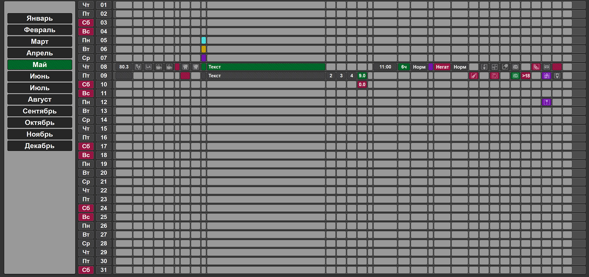

# Индивидуальный трекер привычек

## Краткое описание

Веб-приложение для отслеживания предустановленных привычек по дням месяца.
Пользователь взаимодействует с интерактивными элементами на странице, отмечая выполнение привычек и,
при необходимости, записывая дополнительную информацию. Данные синхронизируются с бэкендом,
хранятся в базе данных PostgreSQL и отображаются в реальном времени.
Также предусмотрена интеграция с Telegram-ботом для удаленного управления состоянием элементов в текущий день.

## Основные возможности

* **Навигация по месяцам:** Удобный выбор месяца с помощью 12 кнопок в левой части экрана.
* **Ежедневное отслеживание:** Отображение информации за выбранный месяц в виде 31 строки, представляющих дни месяца.
* **Интерактивные элементы:** Возможность изменения состояния элементов (контейнеров) простым нажатием.
* **Запись информации:** Для некоторых привычек предусмотрена возможность записи дополнительной текстовой информации.
* **Синхронизация с бэкендом:** Мгновенное обновление данных на сервере (PostgreSQL) при любых изменениях на фронтенде.
* **Обновление в реальном времени:** Отображение актуальных данных на сайте благодаря использованию WebSocket.
* **Интеграция с Telegram-ботом:** Управление состоянием определенных привычек за текущий день через команды Telegram-бота.

## Технологии и инструменты

* **Бэкенд:** Go
    * Используется фреймворк Gin для создания API.
    * WebSocket (github.com/gorilla/websocket) для обеспечения real-time взаимодействия с фронтендом.
    * Библиотека `github.com/lib/pq` для работы с базой данных PostgreSQL.
    * Библиотека `github.com/go-telegram-bot-api/telegram-bot-api/v5` для интеграции с Telegram Bot API.
    * Библиотека `github.com/gin-contrib/cors` для обработки CORS-запросов.
* **База данных:** PostgreSQL
* **Фронтенд:** React
    * Библиотека `axios` для выполнения HTTP-запросов к бэкенду.

